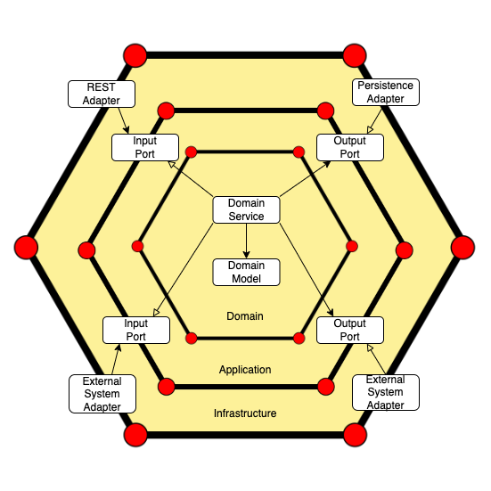

# api-demo

[](https://semver.org)
[](https://example.com/build-status)

api-demo est un composant microservice permettant de gérer des utilisateurs. 

Le composant est construit avec une architecture Domain Driven Development / Hexagonale.

## Table des matières

- [Pré-requis](#pré-requis)
- [Installation](#installation)
- [Exécution](#exécution)
- [Architecture](#architecture)
- [Tests](#tests)
- [Technologies](#technologies)
- [Contribuer](#contribuer)
- [Licence](#licence)

## Pré-requis

Avant d'installer et d'exécuter ce projet, assurez-vous d'avoir les éléments suivants installés sur votre machine :

- Java 22
- [Maven](https://maven.apache.org/)
- Docker

## Installation

### Cloner le projet

```bash
git clone https://github.com/tgirault/api-demo.git
cd api-demo
```

## Exécution

### Build l'image Docker

```bash
docker build -t epsitek-docker-registry/api-demo .
```

### Run l'image Docker

```bash
docker run --name api-demo -p 8080:8080 epsitek-docker-registry/api-demo
```

## Architecture

### Hexagonal Architecture and DDD with Spring Boot


<a href="https://blog.cleancoder.com/uncle-bob/2012/08/13/the-clean-architecture.html">https://blog.cleancoder.com/uncle-bob/2012/08/13/the-clean-architecture.html</a>


The main idea behind this architecture is to isolate domain logic from external components when designing software applications.

Access to domain logic from the outside is available through ports and adapters.



A port is just an interface to be implemented by an adapter. There are two types of ports: input and output. We implement the first ones in the domain layer, while the infrastructure module will contain the implementation of the second ones.

### Example
Let’s consider a simple User REST Service to understand this architecture. Resources of the User service are:

Create a User
Get the User by Id

We start creating the three layers: application, infrastructure, and domain.

### Application
The application layer will contain the ports, which are interfaces that allow inbound or outbound flow.

We created use cases inside the input package, defining what the user would like to do in the application.
In our example, create new Users and get them by Id.

On the other hand, we use the output package to connect to some external components.
In our example, UserOutputPort will get data from the database.

### Infrastructure
The infrastructure layer represents the outer part of the hexagonal architecture through adapters.

Adapters interact with the core application only by using the inbound and outbound ports.

We divide the infrastructure.adapters package into three new ones:

1. config: it contains the beans of the application
2. input: it drives the application by invoking the corresponding use case (input port)
3. output: it provides an implementation of the output ports (databases or messaging queues)

### Domain
The domain layer is the center of the system. It handles the business logic and represents the application core.

The domain layer is wholly decoupled from application and infrastructure layers, so changes in the other layers have no impact on the User domain object unless there is a change in the business requirements.

The UserService is a crucial component inside the domain, as it implements the input ports and uses the output interfaces implemented by the output adapters to return the result to the input adapters

## Tests

## Technologies

## Contribuer

## Licence
