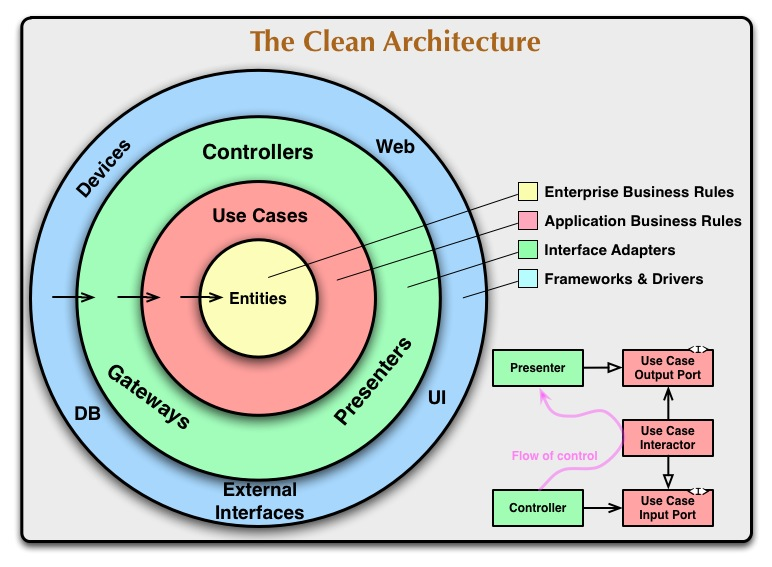
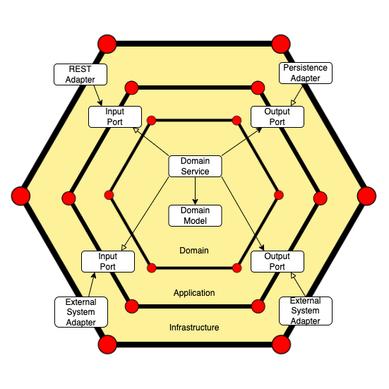

# api-demo

[](https://semver.org)
[](https://example.com/build-status)

api-demo est un composant microservice permettant de gérer des utilisateurs. 

Le composant est construit avec une architecture Domain Driven Development / Hexagonale.

## Table des matières

- [Pré-requis](#pré-requis)
- [Installation](#installation)
- [Exécution](#exécution)
- [Architecture](#architecture)
- [Tests](#tests)
- [Technologies](#technologies)
- [Contribuer](#contribuer)
- [Licence](#licence)

## Pré-requis

Avant d'installer et d'exécuter ce projet, assurez-vous d'avoir les éléments suivants installés sur votre machine :

- Java 22
- [Maven](https://maven.apache.org/)
- Docker

## Installation

### Cloner le projet

```bash
git clone https://github.com/tgirault/api-demo.git
cd api-demo
```

## Exécution

### Build l'image Docker

```bash
docker build -t epsitek/epsitek-docker-registry/api-demo .
```

### Run l'image Docker

```bash
docker run --name api-demo -p 8080:8080 epsitek/epsitek-docker-registry/api-demo
```

### Deploy de l'image Docker sur AWS Elastic Container Registry (ECR)

```bash
aws ecr get-login-password --region eu-west-3 | docker login --username AWS --password-stdin 017605558081.dkr.ecr.eu-west-3.amazonaws.com
docker build -t epsitek/epsitek-docker-registry/api-demo .
docker tag epsitek/epsitek-docker-registry/api-demo:latest 017605558081.dkr.ecr.eu-west-3.amazonaws.com/epsitek/epsitek-docker-registry:latest
docker push 017605558081.dkr.ecr.eu-west-3.amazonaws.com/epsitek/epsitek-docker-registry:latest
```

### Commandes

```bash
   25  curl "https://awscli.amazonaws.com/awscli-exe-linux-x86_64.zip" -o "awscliv2.zip"
   26  unzip awscliv2.zip
   27  aws --version
   28  sudo ./aws/install
   29  sudo apt install unzip
   30  unzip awscliv2.zip
   31  mv ./aws ../../02-tools/
   32  ll
   33  mv ./awscliv2.zip ../../02-tools/
   34  cd ../../02-tools/
   35  sudo ./aws/install
   36  aws --version
   37  docker version
   38  clear
   39  aws ecr get-login-password --region eu-west-3 | docker login --username AWS --password-stdin 017605558081.dkr.ecr.eu-west-3.amazonaws.com
   40  aws configure
   41  aws ecr get-login-password --region eu-west-3 | docker login --username AWS --password-stdin 017605558081.dkr.ecr.eu-west-3.amazonaws.com
   42  docker tag api-demo:0.1.0 017605558081.dkr.ecr.eu-west-3.amazonaws.com/api-demo:0.1.0
   43  docker push 017605558081.dkr.ecr.eu-west-3.amazonaws.com/api-demo:0.1.0
   44  docker tag api-demo:0.1.0 017605558081.dkr.ecr.eu-west-3.amazonaws.com/epsitek-docker-registry/api-demo:0.1.0
   45  docker push 017605558081.dkr.ecr.eu-west-3.amazonaws.com/epsitek-docker-registry/api-demo:0.1.0
   46  aws ecr get-login-password --region eu-west-3 | docker login --username AWS --password-stdin 017605558081.dkr.ecr.eu-west-3.amazonaws.com
   47  docker login --username AWS --password-stdin 017605558081.dkr.ecr.eu-west-3.amazonaws.com
   48  aws ecr get-login-password --region eu-west-3
   49  aws ecr get-login-password --region eu-west-3 --profile
   50  aws ecr get-login-password --region eu-west-3 --profile TechnicalUser
   51  aws configure
   52  aws ecr get-login-password --region eu-west-3 --profile TechnicalUser
   53  aws ecr get-login-password --region eu-west-3
   54  aws ecr get-login-password     --region us-east-1 | docker login     --username AWS     --password-stdin 017605558081.dkr.ecr.us-east-1.amazonaws.com
   55  aws ecr get-login-password     --region us-east-1
   56  aws configure
   57  aws ecr get-login-password     --region us-east-1 | docker login     --username AWS     --password-stdin 017605558081.dkr.ecr.eu-west-3.amazonaws.com/epsitek-docker-registry
   58  docker version
   59  for pkg in docker.io docker-doc docker-compose docker-compose-v2 podman-docker containerd runc; do sudo apt-get remove $pkg; done
   60  # Add Docker's official GPG key:
   61  sudo apt-get update
   62  sudo apt-get install ca-certificates curl
   63  sudo install -m 0755 -d /etc/apt/keyrings
   64  sudo curl -fsSL https://download.docker.com/linux/ubuntu/gpg -o /etc/apt/keyrings/docker.asc
   65  sudo chmod a+r /etc/apt/keyrings/docker.asc
   66  # Add the repository to Apt sources:
   67  echo   "deb [arch=$(dpkg --print-architecture) signed-by=/etc/apt/keyrings/docker.asc] https://download.docker.com/linux/ubuntu \
   68    $(. /etc/os-release && echo "$VERSION_CODENAME") stable" |   sudo tee /etc/apt/sources.list.d/docker.list > /dev/null
   69  sudo apt-get update
   70  docker version
   71  sudo apt-get install docker-ce docker-ce-cli containerd.io docker-buildx-plugin docker-compose-plugin
   72  sudo apt-get update
   73  sudo hwclock --hctosys
   74  sudo apt-get update
   75  aws ecr get-login-password     --region us-east-1 | docker login     --username AWS     --password-stdin 017605558081.dkr.ecr.eu-west-3.amazonaws.com/epsitek-docker-registry
   76  aws ecr get-login-password     --region us-east-1 | docker login     --username AWS     --password-stdin 017605558081.dkr.ecr.eu-west-3.amazonaws.com
   77  docker version
   78  aws ecr get-login-password     --region us-east-1
   79  aws ecr get-login-password --region us-east-1 | docker login --username AWS --password-stdin 017605558081.dkr.ecr.eu-west-3.amazonaws.com
   80  aws ecr get-login-password --region eu-west-3 | docker login --username AWS --password-stdin 017605558081.dkr.ecr.eu-west-3.amazonaws.com
   81  docker build -t epsitek-docker-registry .
   82  docker build -t epsitek-docker-registry/api-demo:0.1.0 .
   83  docker tag epsitek-docker-registry/api-demo:0.1.0 017605558081.dkr.ecr.eu-west-3.amazonaws.com/epsitek-docker-registry/api-demo:0.1.0
   84  docker build -t epsitek-docker-registry/api-demo .
   85  docker tag epsitek-docker-registry/api-demo:0.1.0 017605558081.dkr.ecr.eu-west-3.amazonaws.com/epsitek-docker-registry/api-demo:0.1.0
   86  docker build -t epsitek-docker-registry/api-demo:0.1.0 .
   87  docker tag epsitek-docker-registry/api-demo:0.1.0 017605558081.dkr.ecr.eu-west-3.amazonaws.com/epsitek-docker-registry/api-demo:0.1.0
   88  cd ../01-sources/api-demo/
   89  docker build -t epsitek-docker-registry/api-demo .
   90  docker tag epsitek-docker-registry/api-demo:0.1.0 017605558081.dkr.ecr.eu-west-3.amazonaws.com/epsitek-docker-registry/api-demo:0.1.0
   91  docker tag epsitek-docker-registry/api-demo 017605558081.dkr.ecr.eu-west-3.amazonaws.com/epsitek-docker-registry/api-demo:0.1.0
   92  docker push 017605558081.dkr.ecr.eu-west-3.amazonaws.com/epsitek-docker-registry/api-demo:0.1.0
   93  clear
   94  aws ecr get-login-password --region eu-west-3 | docker login --username AWS --password-stdin 017605558081.dkr.ecr.eu-west-3.amazonaws.com
   95  docker build -t epsitek-docker-registry .
   96  docker tag epsitek-docker-registry:latest 017605558081.dkr.ecr.eu-west-3.amazonaws.com/epsitek-docker-registry:latest
   97  docker push 017605558081.dkr.ecr.eu-west-3.amazonaws.com/epsitek-docker-registry:latest
   98  docker -v
   99  clear
  100  cd /mnt/c/01-sources/api-demo/
  101  ls
  102  docker-compose up -d
  103  docker ps
  104  docker exec -it <kafka-container-id> /opt/kafka/bin/kafka-topics.sh --create --zookeeper zookeeper:2181 --replication-factor 1 --partitions 1 --topic my-topic
  105  docker exec -it 8694ae7ebc69 /opt/kafka/bin/kafka-topics.sh --create --zookeeper zookeeper:2181 --replication-factor 1 --partitions 1 --topic my-topic
  106  docker exec -it 8694ae7ebc69 /opt/kafka/bin/kafka-topics.sh --create --zookeeper zookeeper:2181 --replication-factor 1 --partitions 1 --topic user-registration-event
  107  docker exec -it <kafka-container-id> /opt/kafka/bin/kafka-console-producer.sh --broker-list localhost:9092 --topic my-topic
  108  docker exec -it 8694ae7ebc69 /opt/kafka/bin/kafka-console-producer.sh --broker-list localhost:9092 --topic user-registration-event
  109  docker exec -it <kafka-container-id> /opt/kafka/bin/kafka-console-consumer.sh --bootstrap-server localhost:9092 --topic my-topic --from-beginning
  110  docker exec -it 8694ae7ebc69 /opt/kafka/bin/kafka-console-consumer.sh --bootstrap-server localhost:9092 --topic user-registration-event --from-beginning
  111  docker exec -it 8694ae7ebc69 /opt/kafka/bin/kafka-consumer-groups.sh --all-topics --bootstrap-server localhost:9092 --list
  112  docker exec -it 8694ae7ebc69 /opt/kafka/bin/kafka-console-consumer.sh --bootstrap-server localhost:9092 --topic user-registration-event --from-beginning
  113  docker tag epsitek-docker-registry/api-demo:0.1.0 017605558081.dkr.ecr.eu-west-3.amazonaws.com/epsitek-docker-registry/api-demo:0.1.0
```

## Architecture

### Hexagonal Architecture and DDD with Spring Boot


<a href="https://blog.cleancoder.com/uncle-bob/2012/08/13/the-clean-architecture.html">https://blog.cleancoder.com/uncle-bob/2012/08/13/the-clean-architecture.html</a>


The main idea behind this architecture is to isolate domain logic from external components when designing software applications.

Access to domain logic from the outside is available through ports and adapters.



A port is just an interface to be implemented by an adapter. There are two types of ports: input and output. We implement the first ones in the domain layer, while the infrastructure module will contain the implementation of the second ones.

### Example
Let’s consider a simple User REST Service to understand this architecture. Resources of the User service are:

Create a User
Get the User by Id

We start creating the three layers: application, infrastructure, and domain.

### Application
The application layer will contain the ports, which are interfaces that allow inbound or outbound flow.

We created use cases inside the input package, defining what the user would like to do in the application.
In our example, create new Users and get them by Id.

On the other hand, we use the output package to connect to some external components.
In our example, UserOutputPort will get data from the database.

### Infrastructure
The infrastructure layer represents the outer part of the hexagonal architecture through adapters.

Adapters interact with the core application only by using the inbound and outbound ports.

We divide the infrastructure.adapters package into three new ones:

1. config: it contains the beans of the application
2. input: it drives the application by invoking the corresponding use case (input port)
3. output: it provides an implementation of the output ports (databases or messaging queues)

### Domain
The domain layer is the center of the system. It handles the business logic and represents the application core.

The domain layer is wholly decoupled from application and infrastructure layers, so changes in the other layers have no impact on the User domain object unless there is a change in the business requirements.

The UserService is a crucial component inside the domain, as it implements the input ports and uses the output interfaces implemented by the output adapters to return the result to the input adapters

## Tests

## Technologies

## Contribuer

## Licence
